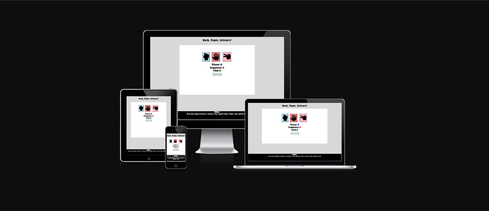

# Rock, Paper, Scissors!

This is my second Milestone project which is basic Rock, Paper, Scissors game. This game has been designed a time consumer for example for people commuting to work or from work.
The game is endless with a prospect of resetting the game.

Rules of the are quite simple. Rock beats scissors, scissors beat paper and paper beats rock. If user and computer uses same hand e.g rock versus rock game will be tied.

View Deployed Site Here! <https://lukasbak.github.io/Rock-Paper-Scissors/>

## User Experience (UX)

- ### User Stories

#### Visitor goals

Reasons for a user to visit the website:

1. To play a game of Rock, Paper, Scissors versus a computer.
2. Play few rounds while commuting to work or back from work.
3. To see if they can beat their previous score or have less tied games.
4. Get their mind off from the surroundings and relax.

