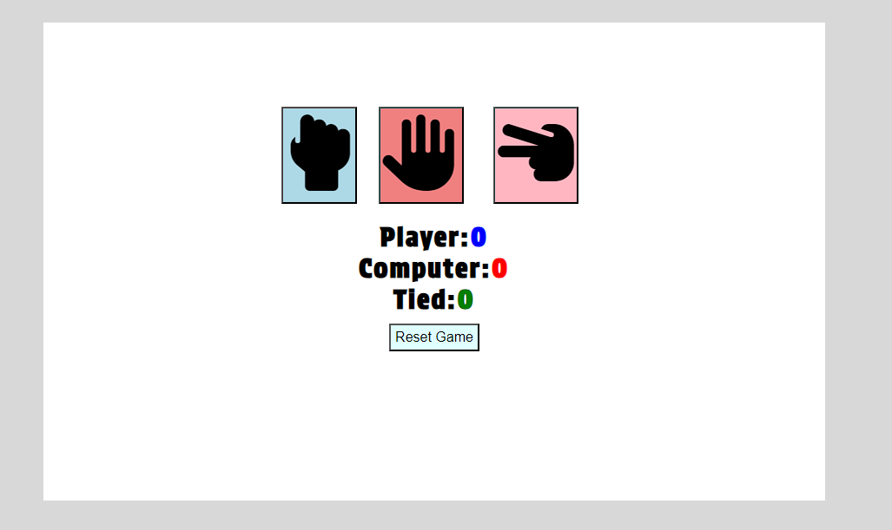
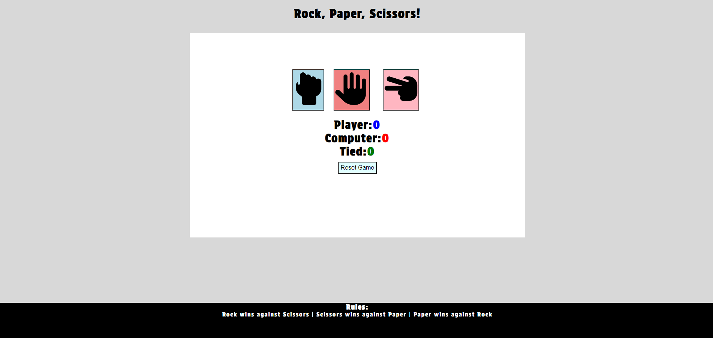
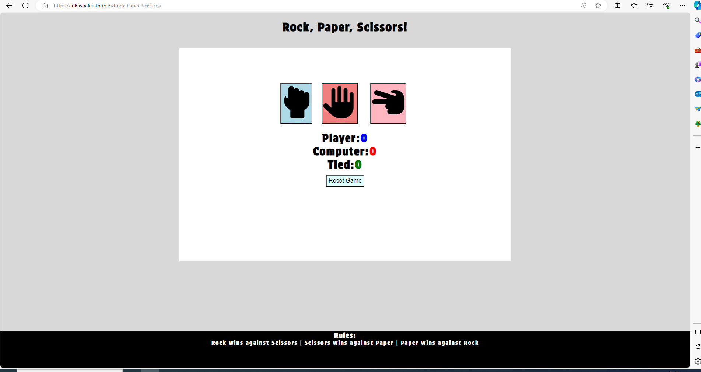
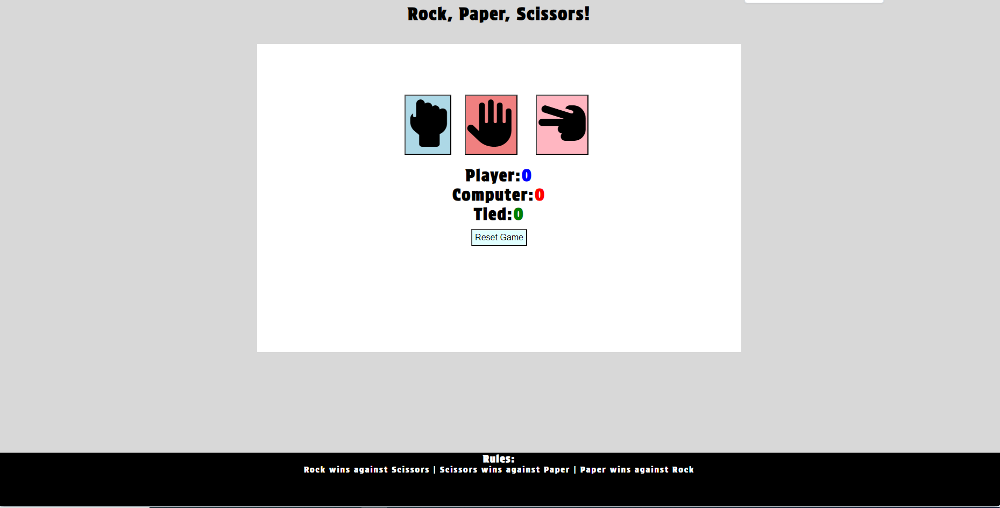
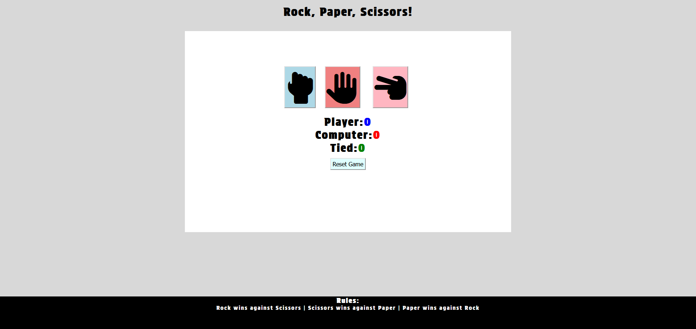
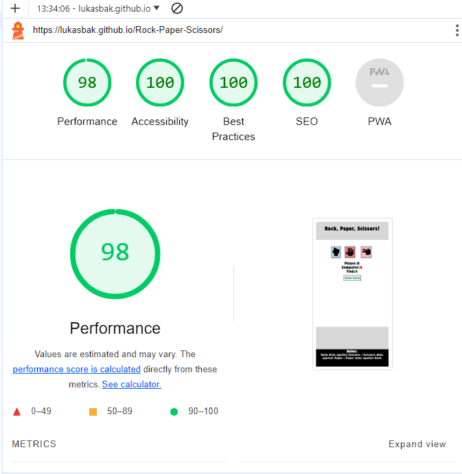
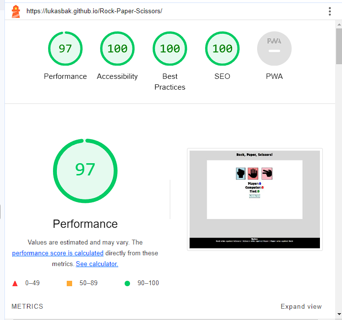
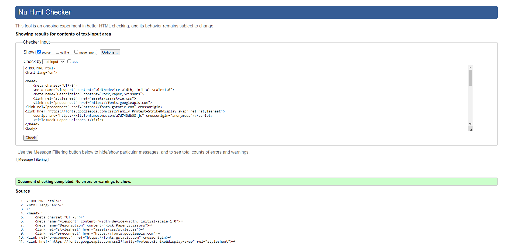
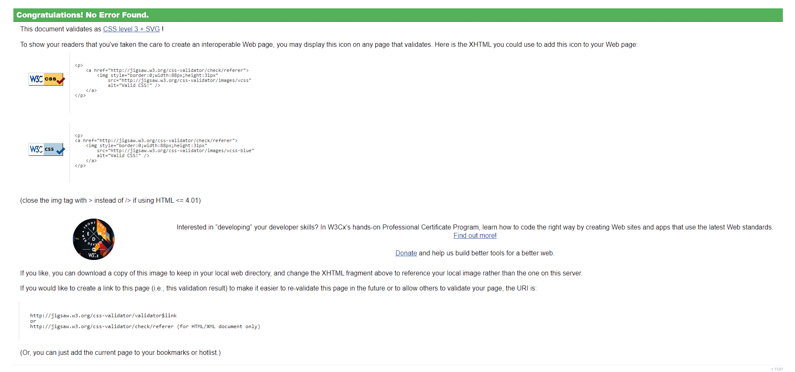
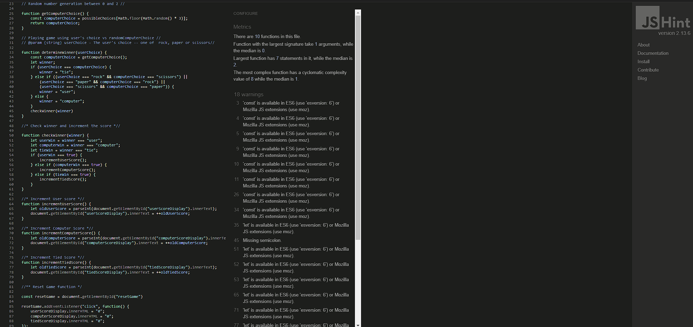

# Rock, Paper, Scissors!

This is my second Milestone project which is a basic Rock, Paper, Scissors game. This game has been designed as a time consumer for example for people commuting to work or from work. The game is endless with the prospect of resetting the game.

The rules of the game are quite simple. Rock beats scissors, scissors beat paper, and paper beats rock. If the user and computer use the same hand e.g rock versus rock game will be tied.

View Deployed Site Here! <https://lukasbak.github.io/Rock-Paper-Scissors/>

## User Experience (UX)

- ### User Stories

#### Visitor goals

Reasons for a user to visit the website:

1. To play a game of Rock, Paper, Scissors versus a computer.
2. Play a few rounds while commuting to work or back from work.
3. To see if they can beat their previous score or have less tied games.
4. Get their mind off from the surroundings and relax.

### Features

#### Header

- Featured at the top of the page shows the game name: Rock, Paper, Scissors!
- The Header shows what kind of game a user will play.

#### Game area

- The game area has interactive buttons for users to play the game with.
- The reset button is there to reset the game scores back to 0
- The options provided are: Rock, Paper, Scissors

#### Footer

-  The Footer contains the rules of Rock, Paper, Scissors that clearly explain which hand will win.

### Possible future features and additions to the website

- In the future, I would like to separate this game into two modes endless and competitive. Currently the game has only endless mode.
- The competitive mode could include Limited losses against the computer to see how many wins a user could accomplish before the game ends.
- Possible highscores sections where users could leave their Highscores as a part of competition.
- Animate user and computer choice that they pop up on the screen as buttons are pressed.

### Testing

- I have tested the website using four different browsers to check whether it would run these were: Google Chrome, Microsoft Edge, Opera and Mozilla Firefox

- I have tested my website on Lighthouse both phone and desktop versions.

- I  have validated my code using W3C css and html validators.
- JShint validator has been used for Javascript validation.

### Deployment

- This site has been deployed to Github pages.
- In the GitHub repository, go to the Settings tab.
- On the left side of the website look for Pages.
- Under build and deployment, click on Deploy and select Deploy From branch, click Save.
- Once the main branch has been selected and saved, the page will be automatically refreshed with a ribbon display to indicate the successful deployment.
- Live link can be found here:[Rock,Paper,Scissors!](https://lukasbak.github.io/Rock-Paper-Scissors/)

### Bugs

- When validating javascript no bugs were found, however, there have been 18 warnings, 2 missing semicolons, 1 unused game variable has been removed because it was unused,
- score display has been used for displaying Scores inside the game.

####  Content

- Code for incrementing User,Computer, and Tied scores has been borrowed from Code Institute Love Maths project.
- Rock, Paper, Scissors buttons have been borrowed from Font Awesome (https://fontawesome.com/)
- Fonts used were 'Protest Strike' and sans-serif which were taken from Google Fonts at (https://fonts.google.com/)

- A big thank you to CI Tutors who helped to troubleshoot as well as my Mentor.

